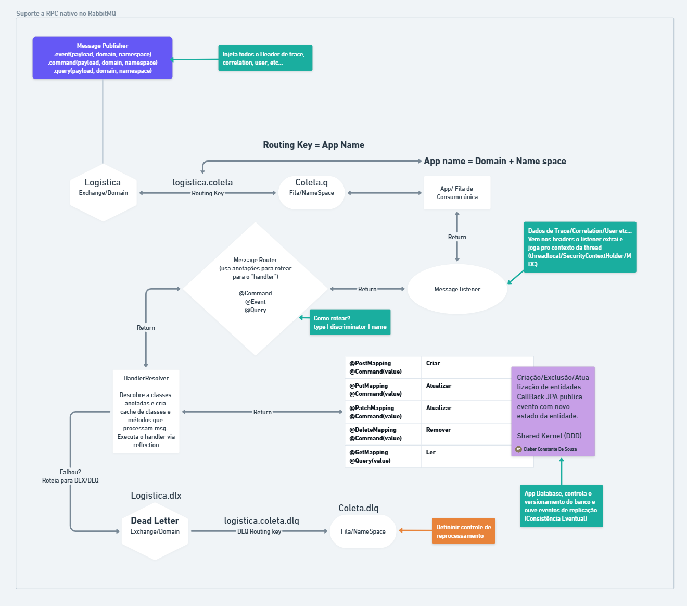

# CCS Message Dispatcher Starter

## Visão Geral

O **Message Dispatcher** é um Spring Boot Starter desenvolvido para simplificar a implementação de microsserviços com mensageria,
eliminando a necessidade de criar múltiplos listeners ou handlers para diferentes tipos de mensagens.
O projeto atua como uma camada de abstração inteligente entre o RabbitMQ e os beans Spring.

---

## Objetivos do Projeto

### Broker e Exchanges

- Utilização do RabbitMQ como message broker
- Exchange global para roteamento centralizado de mensagens
- Exchange global dedicada para dead letters
- Configuração flexível via `application.properties`

### Arquitetura de Filas

- Uma fila dedicada por aplicação
- Routing key única por aplicação
- Dead Letter Queue (DLQ) automática para cada fila/aplicação
- Configurações dinâmicas via `application.properties`

### Processamento de Mensagens

- Suporte a múltiplos consumidores concorrentes por instância
- Controle manual de ACKs para maior confiabilidade
- Prevenção de perda de mensagens por falhas de processamento
- Sistema de retry com reentrega para DLQ

### Proxy e Dispatcher

- Proxy inteligente para publicação de mensagens
- Suporte nativo a padrão RPC via ReplyTo
- Dispatcher automático para controllers Spring
- Integração transparente com `@RestController`

---

## Configuração

### Dependência Maven

```xml
<dependency>
    <groupId>br.com.message-dispatcher</groupId>
    <artifactId>message-dispatcher-starter</artifactId>
    <version>${version}</version>
</dependency>
```

### Configuração Básica

```yaml
ccs:
  dispatcher:
    enabled: true
    host: localhost
    port: 5672
    username: guest
    password: guest
    virtual-host: /
    exchange-name: ccs.dispatcher.ex
    queue-name: ${spring.application.name}
    concurrency: 1-10
```

### Configuração Avançada

```yaml
ccs:
  dispatcher:
    exchange-durable: true
    queue-durable: true
    dead-letter-exchange-name: ccs.dispatcher.ex.dlx
    dead-letter-queue-name: ${spring.application.name}.dlq
    max-retry-attempts: 3
    initial-interval: 1000
    multiplier: 2
    max-interval: 10000
    consumer:
      prefetch-count: 250
      concurrent-consumers: 4
```

---

## Implementação

### Exemplo de Controller

```java

@RestController
@RequestMapping("/")
@RequiredArgsConstructor
@Slf4j
@Validated
@MessageListener // tornar a classe elegível para processar mensagens 
public class NotificationController {

   private final MessagePublisher publisher;

   @PostMapping("sendNotificationSucesso")
   @ResponseStatus(HttpStatus.ACCEPTED)
   @Notification // tonar o método um Handler de mensagens para o tipo especifica, neste exemplo Mensagens do tipo Notification
   public void sendNotificationSucesso(@RequestBody SucessoRecord input) {
      log.info("Método sendNotificationSucesso | Mensagem consumida: {}", input);
      publisher.sendNotification(MsConsumidor.MS_CONSUMIDOR_RK, input);
   }

   @PostMapping("sendNotificationError")
   @ResponseStatus(HttpStatus.ACCEPTED)
   public void sendNotificationError(@RequestBody ExceptionRecord input) {
      publisher.sendNotification(MsConsumidor.MS_CONSUMIDOR_RK, input);
   }

   public record SucessoRecord(@NotNull int id) {
   }

   public record ExceptionRecord(@NotBlank String mensagem) {
   }
}

```

### Exemplo de MessagePublisher

```java
import br.com.messagedispatcher.annotation.MessageListener;
import br.com.messagedispatcher.annotation.Notification;
import br.com.messagedispatcher.publisher.MessagePublisher;
import jakarta.validation.Valid;
import jakarta.validation.constraints.NotBlank;
import jakarta.validation.constraints.NotNull;
import lombok.RequiredArgsConstructor;
import lombok.extern.slf4j.Slf4j;

@RequiredArgsConstructor
@Slf4j
@MessageListener
public class NotificationHandler {

   private final MessagePublisher publisher;

   @Notification
   public void Sucesso(@Valid SucessoRecord payload) {
      log.info("Método sendNotificationSucesso | Mensagem consumida: {}", payload);
      publisher.sendNotification(MsProdutor.MS_PRODUTOR_RK, payload);
   }

   @Notification
   public void erro(@Valid ExceptionRecord payload) {
      throw new UnsupportedOperationException("Método sendNotificationError não implementado");
   }

   public record SucessoRecord(@NotNull int id) {
   }

   public record ExceptionRecord(@NotBlank String mensagem) {
   }
}
```
### Exemplo de Consumidor

```java
@MessageListener
public class MeuListener {

   @Notification
   public void processNotification(SucessoRecord payload) {
      ...
   }

   @Query
   public List<Reponse> doQuery(QueryPayload payload) {
      retrun repository.find(payload);
   }

   @Commando
   public Payload processCommand(Commandpayload payload) {
       return...
   }
   @Event
   public void processEvent(@NotBlank String mensagem) {
      ...
   }
}
```
---

## Funcionalidades Principais

### Gestão de Mensagens

- Roteamento automático baseado em paths
- Conversão automática de payload
- Propagação de headers
- Controle granular de timeouts
- Retry policies configuráveis

### Tratamento de Erros

- Dead Letter Queues automáticas
- Políticas de retry configuráveis
- Logging estruturado de erros
- Monitoramento de falhas

### Performance

- Consumidores concorrentes
- Controle de prefetch
- Otimização de throughput
- Gestão de recursos

---

## Pontos de Atenção e Melhorias Futuras

> ⚠️ Para Revisão e Implementação:

### Resiliência

- Circuit Breaker
- Implementação para chamadas RPC
- Configuração de thresholds
- Políticas de fallback

### Observabilidade

- Integração com Micrometer/Prometheus
- Tracing distribuído (OpenTelemetry)
- Métricas de performance
- Dashboard operacional

### Segurança

- Configuração SSL/TLS
- Autenticação avançada
- Autorização por rotas
- Criptografia de mensagens

### Documentação e Testes

- Documentação automática de rotas
- Testes de integração
- Testes de performance
- Exemplos completos

### Features Adicionais

- Serialização customizada
- Compressão de mensagens
- Suporte a mensagens agendadas
- Filtros de mensagens

---

## Requisitos

- Java 17+
- Spring Boot 3.x ou superior
- RabbitMQ 3.4.x ou superior

---

## Como Contribuir

1. Fork o repositório
2. Crie uma branch para sua feature:  
   `git checkout -b feature/[feature]`
3. Commit suas mudanças:  
   `git commit -m 'Add some [feature]'`
4. Push para a branch:  
   `git push origin feature/[feature]`
5. Abra um Pull Request

---

---
## Licença

Copyright 2024 Cleber Souza

Licensed under the Apache License, Version 2.0 (the "License");
you may not use this file except in compliance with the License.
You may obtain a copy of the License at

    http://www.apache.org/licenses/LICENSE-2.0

Unless required by applicable law or agreed to in writing, software
distributed under the License is distributed on an "AS IS" BASIS,
WITHOUT WARRANTIES OR CONDITIONS OF ANY KIND, either express or implied.
See the License for the specific language governing permissions and
limitations under the License.

---

## Suporte

Para suporte e dúvidas:

- Abra uma issue no GitHub
- Consulte a documentação completa
- Entre em contato com o desenvolvedor principal no LinkedIn: [Cleber Souza](https://www.linkedin.com/feed/update/urn:li:activity:7326769792856600576/)

> **Nota:** Este README está em constante evolução. Sugestões de melhorias são sempre bem-vindas!
