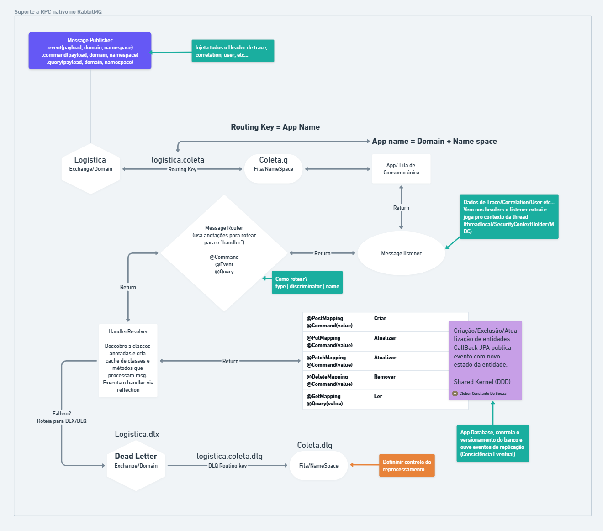

# Message Dispatcher Starter

[English](#english) | [Português](#português)

<a id="english"></a>
## Overview

**Message Dispatcher** is a Spring Boot Starter designed to simplify the implementation of microservices with messaging,
eliminating the need to create multiple listeners or handlers for different types of messages. The project acts as an 
intelligent abstraction layer between RabbitMQ and Spring beans.

## Project Summary

The `message-dispatcher-starter` library facilitates communication between microservices using RabbitMQ as a message broker.
It implements messaging patterns like Command, Query, Event, and Notification, following CQRS (Command Query Responsibility Segregation) principles.

The system works as follows:
1. Producer services send messages using `MessagePublisher`
2. Messages are routed by RabbitMQ to appropriate queues
3. The `RabbitMqMessageDispatcherListener` receives messages
4. The `MessageRouter` forwards messages to corresponding annotated methods
5. Results are returned to the producer when needed (for Commands and Queries)

Key architectural components include:
- Annotation-based message handlers (`@Command`, `@Query`, `@Event`, `@Notification`)
- Message routing system (`MessageRouter`, `AnnotatedMessageRouter`)
- Message publishing (`MessagePublisher`, `RabbitMessagePublisher`)
- RabbitMQ configuration (exchanges, queues, bindings, dead letter queues)
- Handler discovery and validation

### Key Features

- **CQRS Pattern Support**: Command, Query, Event, and Notification message types
- **Automatic Message Routing**: Based on annotations and message types
- **Simplified API**: Declarative approach with annotations
- **Resilient Messaging**: Automatic retries and dead letter queues
- **Flexible Configuration**: Extensive customization via properties

### Architecture Components

- **Message Handlers**: Annotated methods for processing different message types
- **Message Router**: Routes messages to appropriate handlers
- **Message Publisher**: Sends messages to other services
- **RabbitMQ Configuration**: Automatic setup of exchanges, queues, and bindings

## Configuration

### Maven Dependency

```xml
<dependency>
    <groupId>br.com.message-dispatcher</groupId>
    <artifactId>message-dispatcher-starter</artifactId>
    <version>${version}</version>
</dependency>
```

### Basic Configuration

```yaml
message:
  dispatcher:
    enabled: true
    host: localhost
    port: 5672
    username: guest
    password: guest
    virtual-host: /
    exchange-name: message.dispatcher.ex
    queue-name: ${spring.application.name}
    concurrency: 1-10
```

### Advanced Configuration

```yaml
message:
  dispatcher:
    exchange-durable: true
    queue-durable: true
    dead-letter-exchange-name: message.dispatcher.ex.dlx
    dead-letter-queue-name: ${spring.application.name}.dlq
    max-retry-attempts: 3
    initial-interval: 1000
    multiplier: 2
    max-interval: 10000
    prefetch-count: 10
    reply-time-out: 15000
```

## Implementation Examples

### Message Listener Class

```java
@MessageListener
public class MyHandler {

    private final MessagePublisher publisher;

    @Notification
    public void processSuccess(SuccessRecord payload) {
        // Process notification
    }

    @Command
    public CommandResponse handleCommand(CommandRequest payload) {
        // Process command and return response
        return new CommandResponse();
    }

    @Query
    public QueryResult executeQuery(QueryRequest payload) {
        // Execute query and return result
        return new QueryResult();
    }

    @Event
    public void handleEvent(EventData payload) {
        // Process event
    }
}
```

### Message Publisher Usage

```java
@Service
@RequiredArgsConstructor
public class MyService {
    private final MessagePublisher publisher;

    public void sendNotification(NotificationData data) {
        publisher.sendNotification("service-name", data);
    }

    public CommandResponse executeCommand(CommandRequest request) {
        return publisher.doCommand(request, CommandResponse.class);
    }

    public QueryResult executeQuery(QueryRequest request) {
        return publisher.doQuery("service-name", request, QueryResult.class);
    }

    public void publishEvent(EventData event) {
        publisher.sendEvent(event);
    }
}
```

## Requirements

- Java 17+
- Spring Boot 3.x
- RabbitMQ 3.4.x or higher

## License

Copyright 2024 Cleber Souza

Licensed under the Apache License, Version 2.0 (the "License");
you may not use this file except in compliance with the License.
You may obtain a copy of the License at

    http://www.apache.org/licenses/LICENSE-2.0

Unless required by applicable law or agreed to in writing, software
distributed under the License is distributed on an "AS IS" BASIS,
WITHOUT WARRANTIES OR CONDITIONS OF ANY KIND, either express or implied.
See the License for the specific language governing permissions and
limitations under the License.

## Support

For support and questions:

- Open an issue on GitHub
- Consult the complete documentation
- Contact the main developer on LinkedIn: [Cleber Souza](https://www.linkedin.com/feed/update/urn:li:activity:7326769792856600576/)

---

<a id="português"></a>
# Message Dispatcher Starter

## Visão Geral

O **Message Dispatcher** é um Spring Boot Starter desenvolvido para simplificar a implementação de microsserviços com mensageria,
eliminando a necessidade de criar múltiplos listeners ou handlers para diferentes tipos de mensagens. O projeto atua como
uma camada de abstração inteligente entre o RabbitMQ e os beans Spring.

## Resumo do Projeto

A biblioteca `message-dispatcher-starter` facilita a comunicação entre microsserviços usando RabbitMQ como broker de mensagens.
Ela implementa padrões de mensageria como Command, Query, Event e Notification, seguindo princípios de CQRS (Command Query Responsibility Segregation).

O sistema funciona da seguinte forma:
1. Serviços produtores enviam mensagens usando `MessagePublisher`
2. As mensagens são roteadas pelo RabbitMQ para as filas apropriadas
3. O `RabbitMqMessageDispatcherListener` recebe as mensagens
4. O `MessageRouter` encaminha as mensagens para os métodos anotados correspondentes
5. Os resultados são retornados ao produtor quando necessário (para Commands e Queries)

Componentes arquiteturais principais incluem:
- Handlers de mensagens baseados em anotações (`@Command`, `@Query`, `@Event`, `@Notification`)
- Sistema de roteamento de mensagens (`MessageRouter`, `AnnotatedMessageRouter`)
- Publicação de mensagens (`MessagePublisher`, `RabbitMessagePublisher`)
- Configuração do RabbitMQ (exchanges, filas, bindings, filas de dead letter)
- Descoberta e validação de handlers

### Principais Recursos

- **Suporte ao Padrão CQRS**: Tipos de mensagens Command, Query, Event e Notification
- **Roteamento Automático de Mensagens**: Baseado em anotações e tipos de mensagens
- **API Simplificada**: Abordagem declarativa com anotações
- **Mensageria Resiliente**: Retentativas automáticas e filas de dead letter
- **Configuração Flexível**: Ampla personalização via properties

### Componentes da Arquitetura

- **Handlers de Mensagens**: Métodos anotados para processamento de diferentes tipos de mensagens
- **Roteador de Mensagens**: Encaminha mensagens para os handlers apropriados
- **Publicador de Mensagens**: Envia mensagens para outros serviços
- **Configuração do RabbitMQ**: Configuração automática de exchanges, filas e bindings

## Configuração

### Dependência Maven

```xml
<dependency>
    <groupId>br.com.message-dispatcher</groupId>
    <artifactId>message-dispatcher-starter</artifactId>
    <version>${version}</version>
</dependency>
```

### Configuração Básica

```yaml
message:
  dispatcher:
    enabled: true
    host: localhost
    port: 5672
    username: guest
    password: guest
    virtual-host: /
    exchange-name: message.dispatcher.ex
    queue-name: ${spring.application.name}
    concurrency: 1-10
```

### Configuração Avançada

```yaml
message:
  dispatcher:
    exchange-durable: true
    queue-durable: true
    dead-letter-exchange-name: message.dispatcher.ex.dlx
    dead-letter-queue-name: ${spring.application.name}.dlq
    max-retry-attempts: 3
    initial-interval: 1000
    multiplier: 2
    max-interval: 10000
    prefetch-count: 10
    reply-time-out: 15000
```

## Exemplos de Implementação

### Classe de Listener de Mensagens

```java
@MessageListener
public class MeuHandler {

    private final MessagePublisher publisher;

    @Notification
    public void processarSucesso(RegistroSucesso payload) {
        // Processar notificação
    }

    @Command
    public RespostaComando manipularComando(RequisicaoComando payload) {
        // Processar comando e retornar resposta
        return new RespostaComando();
    }

    @Query
    public ResultadoConsulta executarConsulta(RequisicaoConsulta payload) {
        // Executar consulta e retornar resultado
        return new ResultadoConsulta();
    }

    @Event
    public void manipularEvento(DadosEvento payload) {
        // Processar evento
    }
}
```

### Uso do Message Publisher

```java
@Service
@RequiredArgsConstructor
public class MeuServico {
    private final MessagePublisher publisher;

    public void enviarNotificacao(DadosNotificacao dados) {
        publisher.sendNotification("nome-servico", dados);
    }

    public RespostaComando executarComando(RequisicaoComando requisicao) {
        return publisher.doCommand(requisicao, RespostaComando.class);
    }

    public ResultadoConsulta executarConsulta(RequisicaoConsulta requisicao) {
        return publisher.doQuery("nome-servico", requisicao, ResultadoConsulta.class);
    }

    public void publicarEvento(DadosEvento evento) {
        publisher.sendEvent(evento);
    }
}
```

## Requisitos

- Java 17+
- Spring Boot 3.x
- RabbitMQ 3.4.x ou superior
- 
## Visão da arquitetura


## Licença

Copyright 2024 Cleber Souza

Licensed under the Apache License, Version 2.0 (the "License");
you may not use this file except in compliance with the License.
You may obtain a copy of the License at

    http://www.apache.org/licenses/LICENSE-2.0

Unless required by applicable law or agreed to in writing, software
distributed under the License is distributed on an "AS IS" BASIS,
WITHOUT WARRANTIES OR CONDITIONS OF ANY KIND, either express or implied.
See the License for the specific language governing permissions and
limitations under the License.

## Suporte

Para suporte e dúvidas:

- Abra uma issue no GitHub
- Consulte a documentação completa
- Entre em contato com o desenvolvedor principal no LinkedIn: [Cleber Souza](https://www.linkedin.com/feed/update/urn:li:activity:7326769792856600576/)